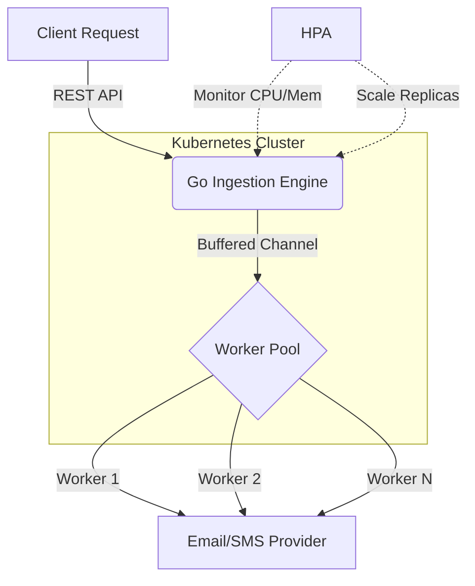

# Distributed Notification Engine
---
### High-Concurrency Microservice with Kubernetes Orchestration

## Overview
In high-scale distributed systems, sending notifications (Email/SMS/Push) synchronously often introduces latency and increases the risk of resource exhaustion. This project implements a high-concurrency notification engine designed to handle 10k+ requests/sec using an asynchronous worker pool pattern.

The service is built in Go for performance, containerized with Docker using minimal and secure images, and deployed on Kubernetes with automated scaling.

## System Architecture
The service is designed for high throughput, fault tolerance, and controlled backpressure.

## System Architecture



---

## Architecture Breakdown

#### Ingestion Layer
Handles incoming HTTP requests, performs validation, and pushes jobs into the internal queue.

#### Processing Layer
A bounded worker pool implemented using Go channels to control concurrency and apply backpressure under load.

#### Orchestration Layer
Kubernetes manages deployment, health checks, and scaling via Horizontal Pod Autoscaler (HPA).

---

### Tech Stack

| Component        | Technology           |
| ---------------- | -------------------- |
| Backend          | Go                   |
| Containerization | Docker (multi-stage) |
| Orchestration    | Kubernetes           |
| Configuration    | Helm                 |

---

## Key Features

#### Asynchronous Processing
Decouples request ingestion from execution to maintain low API latency under load.

#### Backpressure Handling
Bounded queues prevent unbounded memory growth during traffic spikes.

#### Graceful Shutdown
SIGTERM handling ensures in-flight jobs are completed before pod termination.

#### Auto Scaling
HPA scales replicas based on CPU utilization to handle variable workloads.

---
## API Contract

### Endpoint

`POST /notify`

### Request Headers

```http
Content-Type: application/json

{
  "type": "email",
  "recipient": "user@example.com",
  "message": "Hello from the notification service"
}

{
  "status": "accepted",
  "request_id": "abc123"
}

```

---

## Failure Handling

- #### Worker Saturation
  Requests are rejected when the queue reaches capacity to protect the system.
- #### External Provider Failures
  Failures are logged and can be extended with retry or DLQ mechanisms.
- #### Pod Termination
  Graceful shutdown ensures no in-flight jobs are dropped.

---
### Observability
* #### Logging
Structured logs for request lifecycle and worker activity.
* #### Metrics (Extensible)
  - Queue depth
  - Worker utilization
  - Request throughput
* #### Tracing (Extensible)
  OpenTelemetry can be integrated for distributed tracing.

---
### Security Considerations
* Uses minimal base images (distroless) to reduce attack surface
* Runs as non-root user inside containers
* Supports Kubernetes secrets for sensitive configuration
* Designed to work with read-only root filesystems


### Performance Notes
* Designed to handle high concurrency using goroutines and channels
* Load-tested under burst conditions (~10k req/sec)
* Backpressure prevents memory exhaustion during spikes

### Purpose
This project demonstrates building and operating a high-throughput, cloud-native service with a focus on:

* Concurrency and backpressure control
* Resilient microservice design
* Container security and optimization
* Kubernetes-based scaling and lifecycle management

---

### Prerequisites

- Docker
- Kubernetes (Kind or Minikube)
- Go 1.21+
- Helm 3

---

### Installation

Clone the repository:

```bash
git clone https://github.com/your-username/distributed-notification-service.git
cd distributed-notification-service
```

Run the Setup Script:

```bash
chmod +x scripts/setup.sh
./scripts/setup.sh
```

Verify Deployment:
```bash
## Check Running Pods
kubectl get pods

## View logs
kubectl logs -l app.kubernetes.io/name=notify-chart --tail=50
```